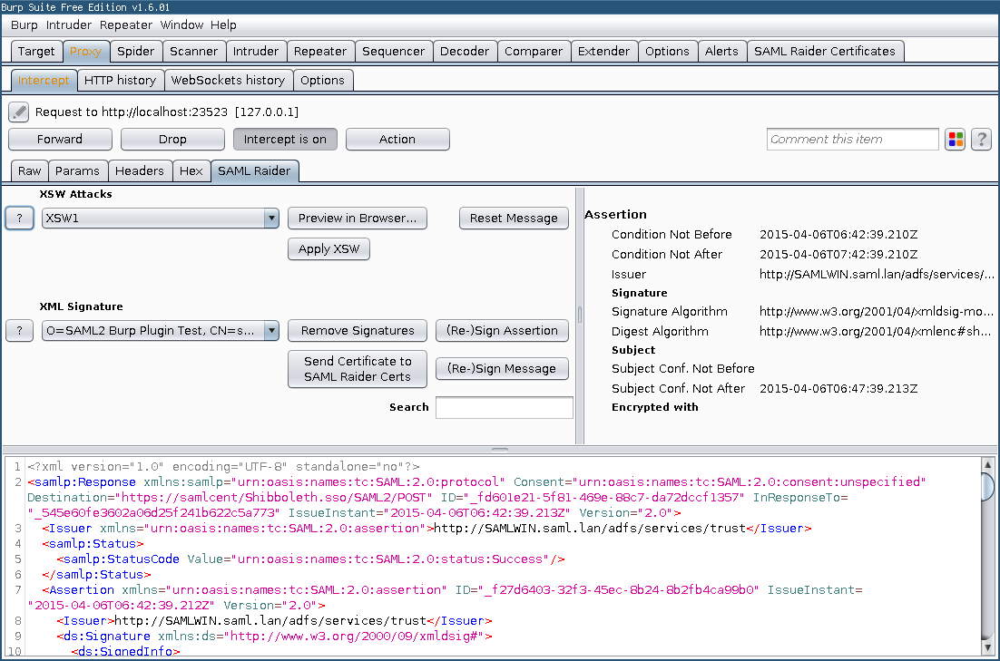
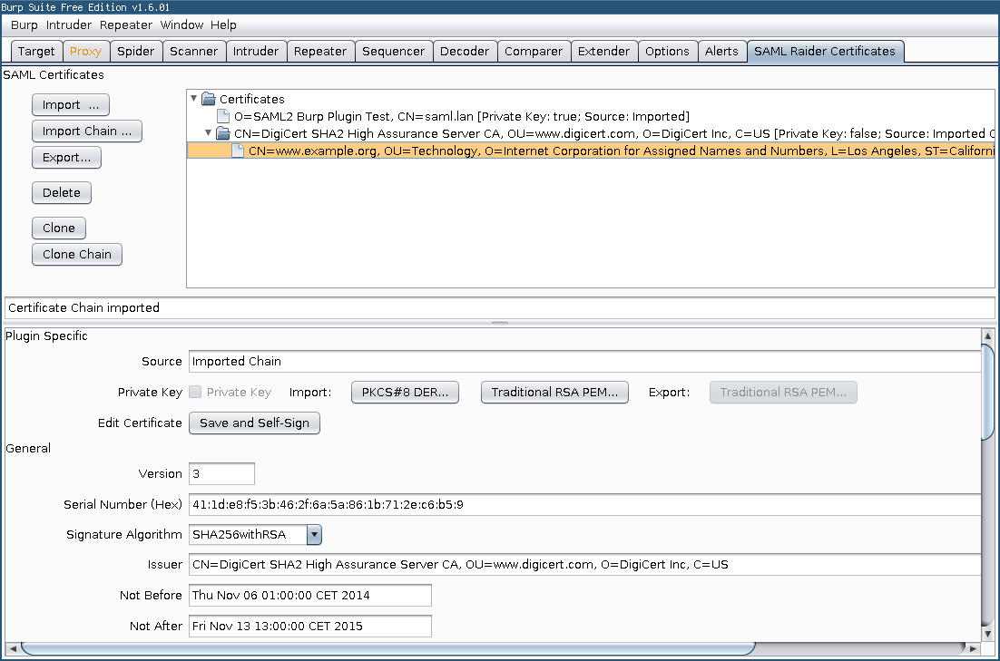

# SAML Raider - SAML2 Burp Extension

## Description

SAML Raider is a Burp Suite extension for testing SAML infrastructures. It
contains two core functionalities: Manipulating SAML Messages and manage X.509
certificates.

This software was created by Roland Bischofberger and Emanuel Duss during
a bachelor thesis at the [Hochschule für Technik
Rapperswil](https://www.hsr.ch) (HSR). Our project partner and advisor was
[Compass Security Schweiz AG](https://www.csnc.ch). We thank Compass for the
nice collaboration and support during our bachelor thesis.

## Features

The extension is divided in two parts. A SAML message editor and a certificate
management tool.

### Message Editor

Features of the SAML Raider message editor:

* Sign SAML Messages
* Sign SAML Assertions
* Remove Signatures
* Edit SAML Message
* Preview eight common XSW Attacks
* Execute eight common XSW Attacks
* Send certificate to SAMl Raider Certificate Management
* Undo all changes of a SAML Message
* Supported Profiles: SAML Webbrowser Single Sign-on Profile, Web Services
  Security SAML Token Profile
* Supported Bindings: POST Binding, Redirect Binding, SOAP Binding

### Certificate Management

Features of the SAML Raider Certificate Management:

* Import X.509 certificates (PEM and DER format)
* Import X.509 certificate chains
* Export X.509 certificates (PEM format)
* Delete imported X.509 certificates
* Display informations of X.509 certificates
* Import private keys (PKCD#8 in DER format and traditional RSA in PEM Format)
* Export private keys (traditional RSA Key PEM Format)
* Cloning X.509 certificates
* Cloning X.509 certificate chains
* Create new X.509 certificates
* Editing and self-sign existing X.509 certificates

## Download

Download: [saml-raider-1.1.1.jar](https://github.com/SAMLRaider/SAMLRaider/releases/download/1.1.1/saml-raider-1.1.1.jar)

## Installation

### Manual Installation

Start the Burp Suite and click at the `Extender` tab on `Add`. Choose the SAML
Raider JAR file to install the extension.

### Installation from BApp Store

The easy way to install SAML Raider is using the BApp Store. Open Burp and
click in the `Extender` tab on the `BApp Store` tab. Select `SAML Raider` and
hit the `Install` button to install our extension.

Don't forget to rate our extension with as many stars you like :smile:.

## Usage

To test SAML environments more comfortable, you could add a intercept rule in
the proxy settings. Add a new rule which checks if a Parameter Name
`SAMLResponse` is in the request. We hope the usage of our extension is mostly
self explaining :smile:.

## Development

### Build

Clone the repository and build the JAR file using Maven:

    $ mvn install

Use the JAR file in `target/saml-raider-1.0-SNAPSHOT-jar-with-dependencies.jar`
as a Burp extension.

### Run SAML Raider inside Eclipse

To start the Extension directly from Eclipse, import the Repository into
Eclipse. Note that the Eclipse Maven Plugin `m2e` is required.

Place the Burp Suite JAR file into the `lib` folder and add the Burp JAR as
a Library in the Eclipse Project (`Properties` → `Build Path` → `Libraries`).

Open the Burp JAR under `Referenced Libraries` in the Package Explorer and
right click in the Package `burp` on `StartBurp.class` and select `Run As...`
→ `Java Application` to start Burp and load the Extension automatically.

### Debug Mode

To enable the Debug Mode, set the `DEBUG` Flag in the Class `Flags` from the
Package `helpers` to `true`. This will write all output to the
`SAMLRaiderDebug.log` logfile and load example certificates for testing.

### Test with fake SAML Response

To send a SAML Response to Burp, you can use the script `samltest` in the
`scripts/samltest` directory. It sends the SAML Response from `saml_response`
to Burp (`localhost:8080`) and prints out the modified response from our
plugin.

## Feedback, Bugs and Feature Requests

Feedback is welcome! Please contact us or create a new issue on GitHub.

## Bachelor Thesis

Our Bachelor thesis is available online and can  be found here:
[eprints_BA_SAML2_Burp_Plugin_SAML_Raider_eduss_rbischof.pdf](http://eprints.hsr.ch/464/1/eprints_BA_SAML2_Burp_Plugin_SAML_Raider_eduss_rbischof.pdf).

## License

See the [LICENSE](LICENSE) file (MIT License) for license rights and
limitations.

## Authors

* Roland Bischofberger (GitHub: [RouLee](https://github.com/RouLee))
* Emanuel Duss (GitHub: [mindfuckup](https://github.com/mindfuckup))
